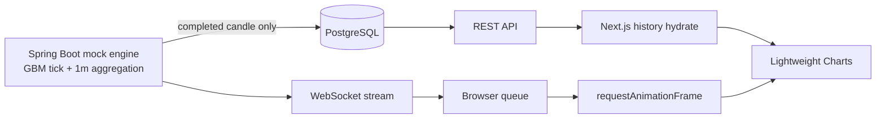

# Realtime Candle Chart

실시간 금융 차트를 만들 때는 데이터를 받아 화면에 그리는 것만으로 끝나지 않습니다. 짧은 간격으로 들어오는 시세를 어떻게 집계할지, React 렌더링과 차트 갱신을 어떻게 분리할지, 새로고침 뒤에도 지난 캔들을 어떻게 이어 보여줄지까지 함께 풀어야 합니다.

이 프로젝트는 그 과정을 직접 설계하고 검증하기 위해 만든 풀스택 실험입니다. 삼성전자 종목코드 `005930`을 본뜬 mock 시세를 서버에서 생성하고, 1분 OHLC 캔들로 집계해 실시간 차트에 보여줍니다. 실제 외부 시세 API는 사용하지 않으며, 가격은 약 ₩75,000에서 시작하는 GBM(기하 브라운 운동) 데이터입니다.

## 어떻게 발전했나요?

처음에는 브라우저 안에서 mock 틱을 만들고 차트를 갱신하는 데 집중했습니다. 고빈도 데이터를 React state에 넣으면 불필요한 리렌더링이 생기기 때문에, 틱을 큐에 모아 `requestAnimationFrame` 주기에 맞춰 Lightweight Charts를 직접 갱신했습니다. 이 단계에서 1분 OHLC 집계, 툴팁, 드래그·줌, 일시정지 같은 기본적인 차트 경험을 완성했습니다.

그다음에는 차트를 하나의 웹 애플리케이션으로 확장했습니다. 완료된 캔들을 PostgreSQL에 저장하고 REST API로 조회하거나 넣을 수 있게 했으며, Next.js가 서버에서 히스토리를 불러와 차트의 시작점을 복원하도록 만들었습니다.

마지막으로 시세 생성과 집계의 책임을 Spring Boot로 옮겼습니다. 브라우저마다 서로 다른 시계열을 만들고 같은 캔들을 덮어쓰는 문제를 없애기 위해, 서버의 단일 mock 엔진이 시세를 만들고 WebSocket으로 모든 구독자에게 같은 흐름을 전달합니다. 현재 구조에서 브라우저는 데이터를 만드는 쪽이 아니라, 저장된 히스토리와 실시간 스트림을 효율적으로 소비하는 쪽에 가깝습니다.

## 현재 동작 방식

홈 화면(`/`)을 열면 Next.js Server Component가 REST API에서 완료된 캔들을 먼저 가져옵니다. 이후 Spring Boot가 300ms 간격으로 만든 GBM 틱을 1분 OHLC로 집계하고, 형성 중인 캔들과 완료된 캔들을 WebSocket으로 보냅니다.

브라우저는 이 메시지를 React state가 아닌 `useRef` 큐에 담습니다. 실제 차트 갱신은 RAF 루프에서만 일어나므로, 스트림 빈도와 React 렌더 주기를 분리할 수 있습니다. 분이 바뀌면 서버가 완료된 캔들만 PostgreSQL에 upsert하고, 아직 형성 중인 캔들은 저장하지 않습니다.



REST 요청은 Next.js Route Handler를 거치므로 브라우저에 Spring 내부 주소를 노출하지 않습니다. WebSocket은 인증 정보가 없는 공개 스트림 URL에 직접 연결합니다. 연결이 끊기거나 백엔드가 내려가더라도 차트 자체는 유지되고, 현재 상태를 화면에 표시합니다.

`/candles`에는 REST 계약을 눈으로 확인할 수 있는 별도 페이지도 있습니다. 저장된 캔들을 조회하고 한 개의 완료 봉을 수동으로 upsert할 수 있습니다. 실제 라이브 차트의 저장은 클라이언트가 아니라 서버의 분 경계 처리에서 담당합니다.

API의 요청·응답 형식과 오류 규칙은 [`docs/specs/api/candles.openapi.yaml`](docs/specs/api/candles.openapi.yaml)에 정의되어 있습니다. `005930`은 mock 엔진이 예약한 심볼이므로 저장된 행이 없어도 빈 목록을 정상 응답합니다.

## 기술 스택

- **Frontend:** Next.js 16.2.2 App Router, React 19, Lightweight Charts, Zustand
- **Backend:** Spring Boot 4.1, Java 21, WebSocket, JPA
- **Database:** PostgreSQL, Flyway
- **Infrastructure:** Docker, Kubernetes, Kustomize
- **Testing:** Vitest, Playwright, JUnit 5, Testcontainers PostgreSQL
- **Runtime:** Node.js 20+, pnpm

Zustand는 일시정지나 UI 선택 상태에만 사용합니다. 스트림 데이터는 전역 상태에 저장하지 않습니다. DB 스키마는 Flyway가 관리하고 JPA는 `ddl-auto=validate`로 일치 여부만 확인합니다. 가격은 PostgreSQL의 `numeric(18,8)`, 시간은 `timestamptz`로 저장합니다.

## 개발 방식

기능은 작은 스펙 단위로 확장했습니다. 프론트와 백엔드 사이를 넘는 변경은 OpenAPI 계약을 먼저 고치고, 양쪽에 실패하는 테스트를 만든 뒤 구현했습니다.

```text
Spec → OpenAPI contract → Failing test → Implementation → Verification
```

이 흐름 덕분에 브라우저 GBM에서 서버 WebSocket으로 구조가 바뀌는 동안에도 기존 REST 계약과 차트 동작을 유지할 수 있었습니다. 스펙과 결정 기록은 [`docs/specs/README.md`](docs/specs/README.md)에서 한 번에 볼 수 있습니다.

주요 코드 위치는 다음과 같습니다.

- `app/`, `components/`, `lib/`, `stores/`: Next.js 프론트엔드
- `backend/`: Spring Boot API와 mock market engine
- `backend/src/main/resources/db/migration/`: Flyway 마이그레이션
- `infra/k8s/`: Kubernetes base와 개발용 overlay
- `docs/specs/`: 기능, API, DB, 인프라 스펙

## 로컬에서 실행하기

먼저 PostgreSQL을 `localhost:5432`에서 실행해 주세요. 기본 DB 이름과 사용자, 비밀번호는 모두 `candles`이며 `POSTGRES_*` 환경 변수로 바꿀 수 있습니다.

```bash
git clone https://github.com/20massalia/realtime-candle-chart
cd realtime-candle-chart
pnpm install
```

첫 번째 터미널에서 API를 실행합니다. 애플리케이션이 시작될 때 Flyway가 스키마를 준비하고 mock 엔진과 WebSocket도 함께 열립니다.

```bash
cd backend
./gradlew bootRun
```

두 번째 터미널에서는 저장소 루트에서 Next.js를 실행합니다.

```bash
BACKEND_URL=http://localhost:8080 pnpm dev
```

- 차트: [http://localhost:3000](http://localhost:3000)
- API 검증 페이지: [http://localhost:3000/candles](http://localhost:3000/candles)

`NEXT_PUBLIC_CANDLE_WS_URL`을 생략하면 브라우저는 `ws://localhost:8080/ws/v1/candles`를 사용합니다. 통합 테스트에서는 테스트 데이터가 mock 엔진에 의해 바뀌지 않도록 엔진을 비활성화합니다.

## Vercel + Render 배포

Vercel에는 Next.js만 올라가며, Spring Boot API와 PostgreSQL은 별도로 실행해야 합니다. 프론트는 서버에서 `BACKEND_URL`로 REST를 프록시하고, 브라우저는 `NEXT_PUBLIC_CANDLE_WS_URL`로 WebSocket에 직접 연결합니다.

1. [Render Dashboard](https://dashboard.render.com/) → **New → Blueprint** → 이 저장소를 연결하고 `render.yaml`을 적용합니다. (`realtime-candle-api` 웹 서비스 + `candle-db` PostgreSQL)
2. Blueprint 배포가 Ready가 되면 `https://realtime-candle-api.onrender.com/actuator/health/liveness`가 200을 반환하는지 확인합니다.
3. Vercel 프로젝트에 아래 환경 변수를 설정합니다 (또는 저장소의 `.env.production`을 그대로 사용).

```bash
BACKEND_URL=https://realtime-candle-api.onrender.com
NEXT_PUBLIC_CANDLE_WS_URL=wss://realtime-candle-api.onrender.com/ws/v1/candles
```

Render 서비스 이름을 바꾼 경우 위 URL과 `render.yaml`의 `CANDLE_WEBSOCKET_ALLOWED_ORIGINS`, `.env.production` 값을 함께 맞춰 주세요.

- 데모: [https://realtime-candle-chart.vercel.app](https://realtime-candle-chart.vercel.app)

## 테스트

프론트엔드의 타입, 린트, 단위 테스트와 브라우저 시나리오는 다음 명령으로 확인할 수 있습니다.

```bash
pnpm typecheck && pnpm lint && pnpm test
pnpm test:e2e
```

백엔드 테스트는 실제 PostgreSQL 동작과의 차이를 줄이기 위해 Testcontainers를 사용합니다.

```bash
cd backend
./gradlew test
```

PR과 `main` push에서는 같은 게이트가 [GitHub Actions](.github/workflows/ci.yml)에서 병렬로 돌아갑니다 (`frontend` / `backend` / `k8s` / `e2e`). ingest E2E(`@needs-api`)는 CI에 백엔드가 없어 제외합니다. 런이 끝나면 Summary에 job별 초 단위 시간이 남습니다.

캐시 전후 시간을 재려면 Actions 탭에서 **Run workflow**를 쓰거나:

```bash
# 캐시 없는 베이스라인
gh workflow run ci.yml -f use_cache=false -f run_e2e=true

# 캐시 사용 (기본값과 동일)
gh workflow run ci.yml -f use_cache=true -f run_e2e=true
```

같은 커밋으로 각 조건을 여러 번 돌린 뒤, 첫 런(의존성 워밍)은 버리고 p50을 비교하면 됩니다. Required checks에는 먼저 `frontend`, `backend`, `k8s`를 걸고, e2e가 안정이면 추가하세요.

## 로컬 Kubernetes

로컬 클러스터에서는 PostgreSQL과 Spring Boot API만 실행하고, Next.js는 호스트에서 실행합니다. 개발 overlay는 Docker Desktop Kubernetes와 kind `candle-dev`를 지원합니다.

```bash
docker build -t candle-api:0.0.1-006 -f backend/Dockerfile backend

# kind를 사용하는 경우
kind load docker-image candle-api:0.0.1-006 --name candle-dev

kubectl apply -k infra/k8s/overlays/dev
kubectl -n candle-dev port-forward svc/api 8080:8080
```

적용 전에 매니페스트를 정적으로 검증할 수 있습니다.

```bash
kubectl kustomize infra/k8s/overlays/dev | kubeconform -strict -summary -
```

이미지 태그와 리소스, 로컬 Secret은 개발 overlay에서 주입합니다. 저장소에는 운영 비밀번호를 두지 않습니다.

## 더 살펴보기

구현 과정은 아래 스펙에 순서대로 남아 있습니다.

- [`docs/spec-phase1.md`](docs/spec-phase1.md): 브라우저 GBM, RAF 큐, OHLC 렌더링
- [`docs/specs/001-candles-api.md`](docs/specs/001-candles-api.md): 캔들 조회 API
- [`docs/specs/002-local-k8s.md`](docs/specs/002-local-k8s.md): 로컬 Kubernetes 환경
- [`docs/specs/003-candle-ingest.md`](docs/specs/003-candle-ingest.md): 완료 봉 upsert
- [`docs/specs/004-samsung-mock-fixture.md`](docs/specs/004-samsung-mock-fixture.md): `005930` mock 기준 통일
- [`docs/specs/005-chart-hydrate-roll-persist.md`](docs/specs/005-chart-hydrate-roll-persist.md): DB 히스토리 hydrate
- [`docs/specs/006-server-gbm-websocket.md`](docs/specs/006-server-gbm-websocket.md): 서버 GBM과 WebSocket 스트림
- [`docs/specs/007-github-actions-ci.md`](docs/specs/007-github-actions-ci.md): GitHub Actions CI 게이트

현재까지 REST 조회·저장, 서버 mock engine, WebSocket 스트리밍, 로컬 Kubernetes 구성을 마쳤습니다. 다음 단계에서는 심볼과 인터벌을 확장하고, 외부 시세 연동이나 인증·재시도 정책, Ingress/TLS 같은 운영 환경의 문제를 다룰 수 있습니다.
